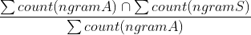

# Plagiarism Project, Machine Learning Deployment

This repository contains code and associated files for deploying a plagiarism detector using AWS SageMaker.

## Project Overview

In this project, we build a plagiarism detector that examines a text file and performs binary classification; labeling that file as either *plagiarized* or *not*, depending on how similar that text file is to a provided source text. Detecting plagiarism is an active area of research; the task is non-trivial and the differences between paraphrased answers and original work are often not so obvious.

This project is be broken down into three main notebooks:

**Notebook 1: Data Exploration**
* Load in the corpus of plagiarism text data.
* Explore the existing data features and the data distribution.

**Notebook 2: Feature Engineering**

* Clean and pre-process the text data.
* Define features for comparing the similarity of an answer text and a source text, and extract similarity features.
* Select "good" features, by analyzing the correlations between different features.
* Create train/test `.csv` files that hold the relevant features and class labels for train/test data points.

**Notebook 3: Train and Deploy Your Model in SageMaker**

* Upload your train/test feature data to S3.
* Define a binary classification model and a training script.
* Train your model and deploy it using SageMaker.
* Evaluate your deployed classifier.

---

# Requirements

Please see the [README](https://github.com/udacity/ML_SageMaker_Studies/tree/master/README.md) in the root directory for instructions on setting up a SageMaker notebook and downloading the project files (as well as the other notebooks).

# Development

We used feature engineering to extract similarities from provided answers and source texts. We used a mix of **containment features** and **longest common subsequence**

-**containment features**. To understand containment, let's first revisit a definition of [n-grams](https://en.wikipedia.org/wiki/N-gram). An *n-gram* is a sequential word grouping. For example, in a line like "bayes rule gives us a way to combine prior knowledge with new information," a 1-gram is just one word, like "bayes." A 2-gram might be "bayes rule" and a 3-gram might be "combine prior knowledge."

> Containment is defined as the *intersection* of the n-gram word count of the Wikipedia Source Text (S) with the n-gram word count of the Student  Answer Text (S) *divided* by the n-gram word count of the Student Answer Text.

  

If the two texts have no n-grams in common, the containment will be 0, but if _all_ their n-grams intersect then the containment will be 1. Intuitively, you can see how having longer n-gram's in common, might be an indication of cut-and-paste plagiarism.

-**longest common subsequence**.

> The longest common subsequence is the longest string of words (or letters) that are *the same* between the Wikipedia Source Text (S) and the Student Answer Text (A). This value is also normalized by dividing by the total number of words (or letters) in the  Student Answer Text.

**Random Forest**

> Random Forest is an ensemble of Decision Trees, generally trained via the bagging method (or sometimes pasting),
> The Random Forest algorithm introduces extra randomness when growing trees; instead of searching for the very best feature when splitting a node, it searches for the best feature among a random subset of features. This results in a greater tree diversity, which  trades a higher bias for a lower variance, generally yielding an overall better model.

# Results
Using a random forest classifier we achieved **96% accuracy** on all test cases.
